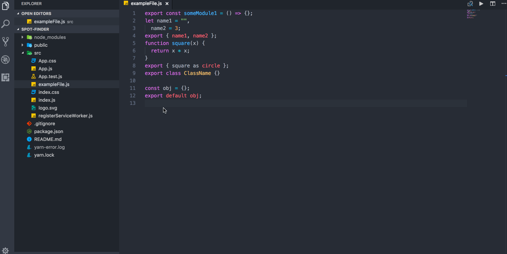

# 

js-test-gen-vscode generates test templates from your default/named exports.

## Features

### Generate Test templates

Creates a new test template file, for all your default/named exports

### Generate Test from your selections

Creates a unit test template and copies it to the keyboard, from your default/named exports selection

## Installation

You can install it from the CLI

`ext install prettier-vscode`

Or you can install from Settings view by searching for `js-test-gen-atom`.

## Extension Settings

| property      | type                 | default   | description                                                                                                                                         |
| ------------- | -------------------- | --------- | --------------------------------------------------------------------------------------------------------------------------------------------------- |
| `testDirName` | `string`             | `""`      | Set the directory name for where the test template will be saved to (E.G. `__tests__`). If not set, the test will be saved to the current directory |
| `testSufix`   | `string`             | `".test"` | Appends a string to your test file E.G: 'myfile.test.js'                                                                                            |
| `typeSystem`  | `Flow or typescript` | `""`      | "Specify if the code the tests are being generated for contain a type system I.E flow/tyescript"                                                    |

## Key bindings

* `jsTestGen.generateTestTemplate` default `ctrl-alt-g` Generates a new test template file for all your named/default exports

* `jsTestGen.generateTest` default: `ctrl-alt-s`, Generates a unit test template based on your selection

## Release Notes

### v0.5.0
More information can be found at [js-tes-gen release](https://github.com/js-test-gen/js-test-gen/releases)
